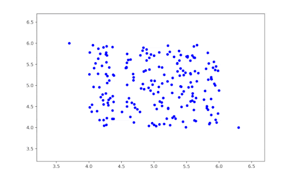

<div align= >

# Anomaly-Detection


</div>
<div align="center">
   
   <br>


</div>

<p align="center">
    <br>
</p>

##  Overview

<ul>
<li> Built using <a href="https://docs.python.org/3/">Python</a>.</li>
<li> This is a solution for Anomaly Detection Problem</li>
<li> This Project simulates real-time sequences of floating-point numbers, that could represent various metrics such as financial transactions or system metrics.</li>

<br>

</ul>
</li>
</ul>
<a id = "Started"></a>

##  How To Run

- First install the <a href="https://github.com/nouralmulhem/Cipher-Sphere/blob/main/requirements.txt">needed packages</a>.</li>

```sh
pip install -r requirements.txt
```

- Folder Structure

```sh
├─── images
├─── src
│   ├── model
│     └─── autoencoder_model.h5
│   ├── RNN
│     ├── RNN.ipynb
│     └─── utile.py
│   ├── AnomalyDetection.py
│   ├── Hotelling.py
│   └─── Streaming.py
....
```

<br/>

## Anomaly Detection Script

This script allows you to run different anomaly detection algorithms on your data.

### Available Algorithms

- `hotelling`: Hotelling's T-squared algorithm for multivariate anomaly detection.
- `ocsvm`: One-Class Support Vector Machine for anomaly detection.
- `variance`: Variance-based anomaly detection.
- `isolated_forest`: Isolation Forest algorithm for anomaly detection.

### Usage

To run the script, use the following command:

```sh
python path/to/AnomalyDetection.py --algo <algorithm> [--plot]
```

- `--algo <algorithm>`: Choose the algorithm to run. Options are `hotelling`, `ocsvm`, `variance`, and `isolated_forest`.
- `--plot`: (Optional) Set this flag to plot the results.

<br/>

## Streaming Script

This script allows you to run and stream the data and detect anomalies on the fly from generated data


### Usage

To run the script, use the following command:

```sh
python path/to/Streaming.py 
```
OR
```sh
python path/to/StreamingV2.py 
```

<br/>

<hr style="background-color: #4b4c60"></hr>

<a id ="References"></a>

##  References


| Name       | Link                                                                 |
|-----------------|--------------------------------------------------------------------------|
| ` Adversarially Learned Anomaly Detection`     | [Link](https://arxiv.org/abs/1812.02288) |
| `How to use Python for anomaly detection in data: Detailed Steps`         | [Link](https://dataheadhunters.com/academy/how-to-use-python-for-anomaly-detection-in-data-detailed-steps/) |
| `Anomaly Detection`      | [Link](https://avinetworks.com/glossary/anomaly-detection/#:~:text=Anomaly%20detection%20is%20the%20identification,noise%2C%20novelties%2C%20and%20exceptions.) |

<br/>
<hr style="background-color: #4b4c60"></hr>
<a id ="Contributors"></a>

##  Contributors

<table >
  <tr>
    <td align="center"><a href="https://github.com/nouralmulhem"><br /><sub><b>Nour Almulhem</b></sub></a><br /></td>
  </tr>
</table>

<a id ="License"></a>

## 🔒 License

> **Note**: This software is licensed under MIT License, See [License](https://github.com/nouralmulhem/Cipher-Sphere/blob/main/LICENSE) for more information ©nouralmulhem.
